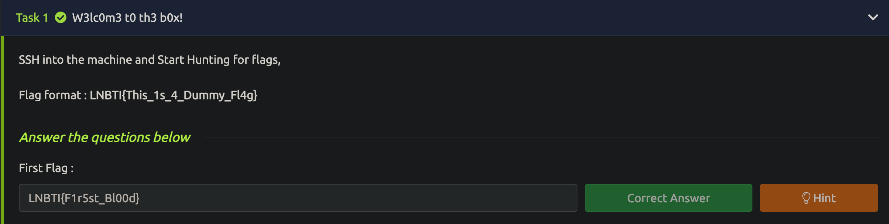

### Session : Intro to KaliLinux and Linux Fundamentals


First we used `ssh` to login into the machine and was able to see our first flag, so we used the `cat` command to view the content inside the flag :

```
destiny@Heshans-Air ~ % ssh root@173.255.215.246
root@173.255.215.246's password: 
Welcome to Ubuntu 20.04.6 LTS (GNU/Linux 5.4.0-162-generic x86_64)
.
.
.
root@localhost:~# ls
avengers  flag1.txt  

root@localhost:~# cat flag1.txt 
LNBTI{F1r5st_Bl00d}
```

We copied the flag `LNBTI{F1r5st_Bl00d}` and pasted it to our tryhackme's tasks, flag1 :



Then the second question on the tryhackme room task was `usernames?` that might be related to the file where usernames are stored in linux.. so we checked the hint :


So we verified something is inside the passwd file.

**Note : In Linux systems, The `/etc/passwd` file stores the information about the usernames of the machine**

We used the `cat` command to view the file and found the second flag :

```
root@localhost:~# cat /etc/passwd

root:x:0:0:root:/root:/bin/bash
daemon:x:1:1:daemon:/usr/sbin:/usr/sbin/nologin
.
.
.
systemd-coredump:x:999:999:systemd Core Dumper:/:/usr/sbin/nologin
LNBTI{3tC_P4ssw0rd}
```

We then pasted our flag in the task and moved on to the next flag :


Using the same method, we then looked into the password file as the question on the task was named as `passwords?` and was able to get our third flag..

**Note : In Linux systems, The `/etc/shadow` file stores the passwords of the users in the machine**

```
root@localhost:~# cat /etc/shadow
root:$6$dlcvPxlQkPPAPPNg$wfCr7wSO8vjPPItUrp3b25h/Gwf.vk9AzmiqCPVeEvJMrNQLJjNMffjp6j41i2HN4I3Im11awv0WacZ1c822X1:19606:0:99999:7:::
daemon:*:19606:0:99999:7:::
.
.
.
systemd-coredump:!!:19699::::::
LNBTI{Sh4d0w_F1l3s}
```

And we got the points by submitting the flag :


Our next question was `can you find me?` and it had a hint as `foundme.txt` so as we are inside the `/root` directory of the machine and we have a file name. We used the `find` command to look for a file named `foundme.txt` inside the `/root` directory :

```
find -name foundme.txt
```

- `find`: This is the command used for searching files and directories.
- `-name`: This option specifies that the search criteria will be based on the name of the file.
- `foundme.txt`: This is the name of the file to search for.

And we were able to see the file inside a hidden directory named `haha`.

```
root@localhost:~# find -name foundme.txt
./.haha/foundme.txt
```

So we used the `cat` command again to read the files content and we got our flag and submitted it:

```
root@localhost:~# cat ./.haha/foundme.txt
LNBTI{F1nd_Cmd}
```


The last flag had a hint named `steve rogers` and to our surprise, there was a `avengers` directory in the `/root` directory (Root is the default directory for the `root` user, it's like his desktop)


This `steve.txt` was a long file and it is very difficult to find a flag inside it. 
So we used the newly learnt `grep` command with the `|` (pipe) to see our flag.
We used the word `LNBTI` following by the grep command as we know that is our flag format looks like .


```
cat steve.txt | grep LNBTI
```

- `cat steve.txt`: The `cat` command is used to concatenate and display the contents of the "steve.txt" file.
- `|`: This is a pipe symbol, and it is used to redirect the output of the `cat` command as input to the `grep` command.
- `grep LNBTI`: The `grep` command is used to search for lines in the input that match the pattern "LNBTI." It filters and displays only the lines containing the specified pattern.

And we successfully hunted down all the flags!