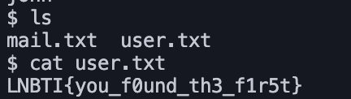
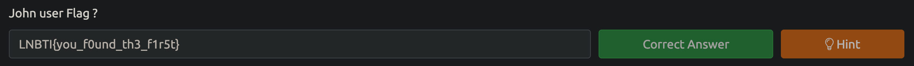
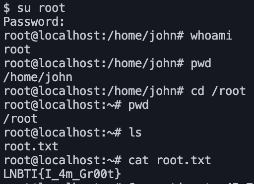
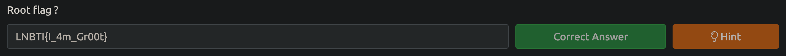
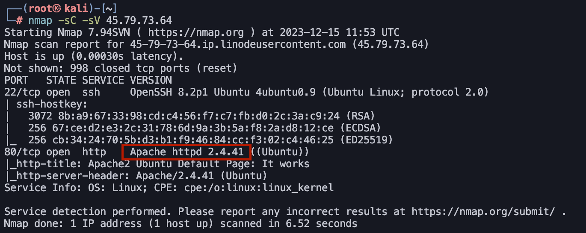
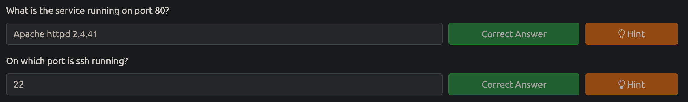

### Session : Linux Fundamentals II and Network Exploitation


First we used SSH to login to the machine as the user `john` using it's ip address  and the command `ssh john@ip_address` 

```sh
destiny@Heshans-Air ~ % ssh john@45.79.73.64
john@45.79.73.64's password:
Welcome to Ubuntu 20.04.6 LTS (GNU/Linux 5.4.0-169-generic x86_64)
* Documentation: https://help.ubuntu.com
* Management: https://landscape.canonical.com
* Support: https://ubuntu.com/advantage
.
.
.
.
Last login: Fri Dec 15 11:47:51 2023 from 43.250.243.62
$ whoami
john
```

Then we used the `ls` command to look inside our current directory and found the `user.txt`(user flag) and another file named `mail.txt`. 


We submitted the user flag to the TryHackme.


We then used the `cat` command to look inside the `mail.txt` and was able to find a mail from the system admin that contained the password of the `root` user. 
```
$ cat mail.txt

Subject: Password Reset Notification

Dear System Administrator,
I hope this message finds you well. We would like to inform you that the password for the user 'root' has been reset due to security measures. The new password for 'root' is: 4064895eE## . Ple

ase ensure to update your records accordingly. If you have any questions or concerns, feel free to reach out to us. We appreciate your attention to security matters and thank you for your cooperation.

Best regards,
LNBTI Admin
```

We then used the `su` command to change the switch user to `root` .
Then we were accessing the `root` users shell. We then went to the `/root` directory using the `cd` command and was able to `cat` the root flag and submit to TryHackMe.




For the 3rd Question, it had as `What is the service running on port 80?`. So we had to run a **Port Scan** using `nmap` tool. The basic command to run a script scan on a machine in nmap is as follows :

```sh
nmap -sC -sV <ip_address>
```

We went to our Kali Linux Vm as it had `nmap` pre installed (Note that you can install nmap to any Operating system you want). And ran a script scan against the machine we are attacking.

```
┌──(root㉿ kali)-[~]
└─# nmap -sC -sV 45.79.73.64
```

We were able to find that Port 22 was running SSH and there was a web server running on port 80. Looking further into the output. We were able to find the service was a Apache webserver with it's version. 




So we copied it and pasted to Tryhackme and finally for the final question we inserted the answer as `22` as the ssh was running on that port (and it is the default port for ssh).


