### Session : Password Cracking and Basic Linux Privilege Escalation II

### Recon

We ran an `nmap` scan as usual to check the open ports in this machine before attacking :

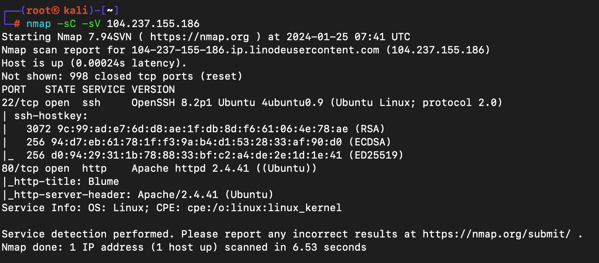

To enumerate Port 80, we used a web browser and visited the ip address of the machine and was able to see a website:

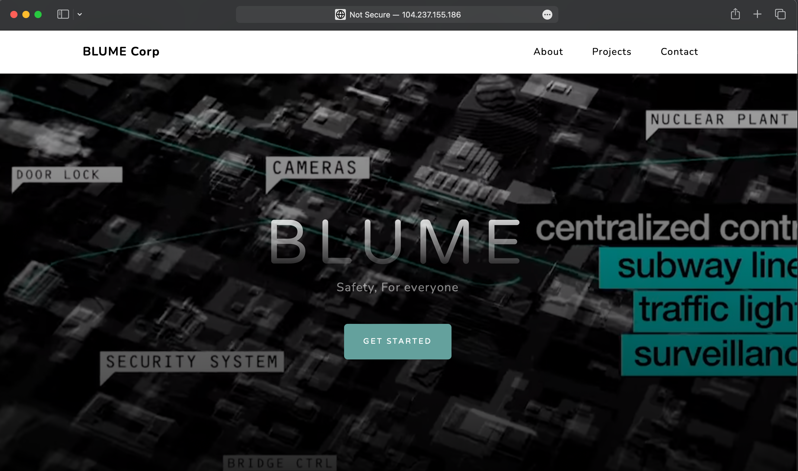

We couldn't find anything interesting there so we bruteforced for directories using `Gobuster` tool to find any hidden directories that can be useful and was able to find a directory named `/news` :

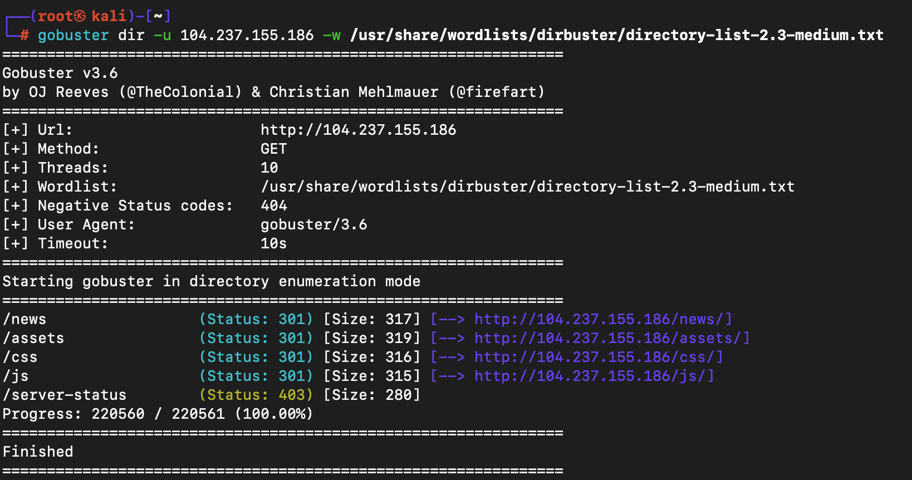

We then visited that directory `/news` and was able to see a `pdf` file :

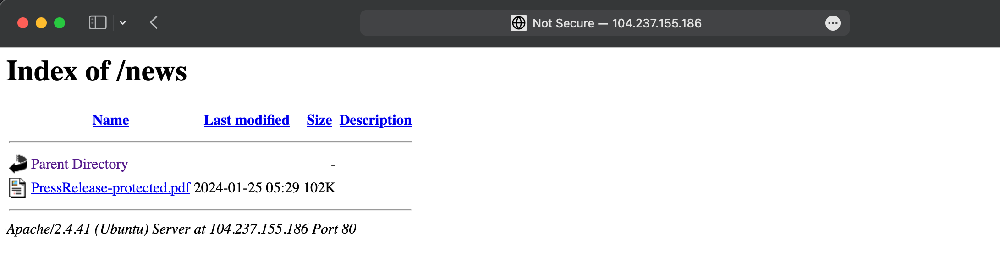

### Exploitation

We downloaded it to our machine to see the contents of it. (I used the `wget` command here to download the file to my machine using the command line):

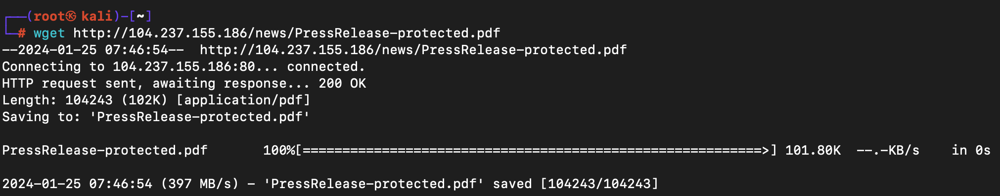

We were able to see that this file was password protected. Since we didn't have any passwords, We had no other option but to crack the password :

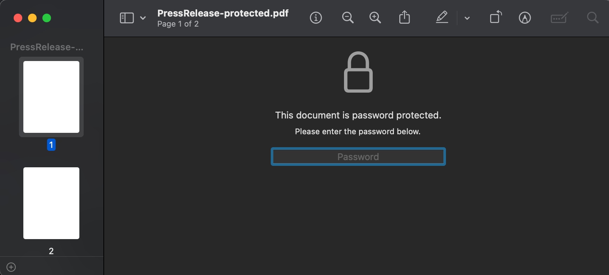

We used `John The Ripper`s `pdf2john` module to convert our file into a hash:

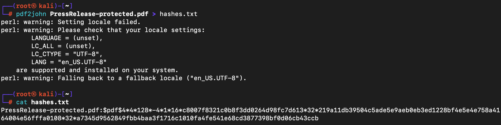

Then we cracked the hash using `John` and the `rockyou.txt` password list and was able to find the password of the pdf file:

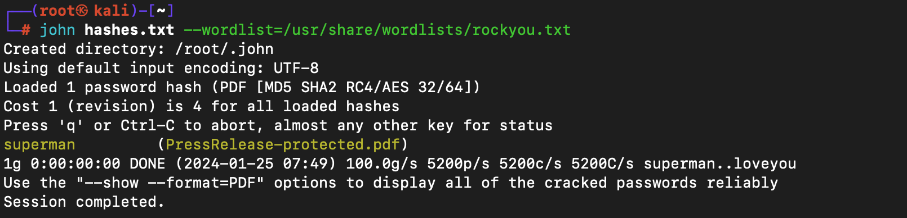

We were then able to see the flag that was hidden inside the PDF file:

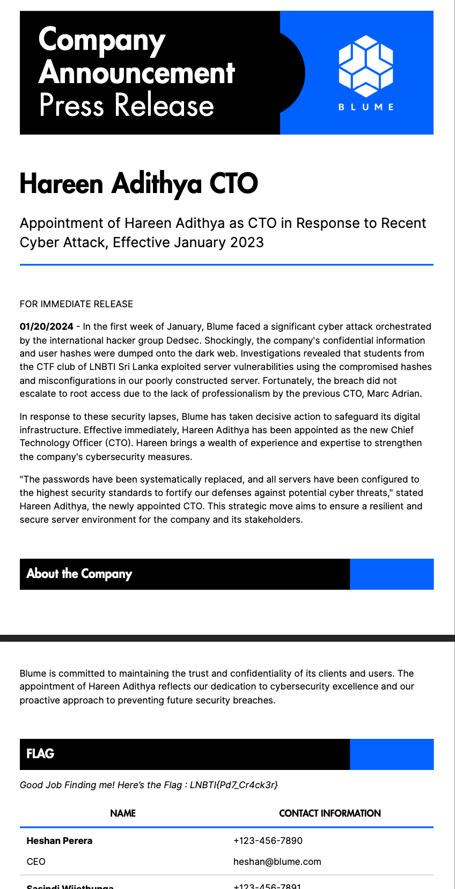

We used the `ssh hareen@<machine_ip>` and as the password we used the same `superman` password that we got after cracking the pdf hash and we were able to login to the machine and grab the user flag : ( This step showed a Password reuse where we use the same password for all of our things ;) )

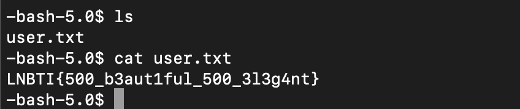

### Privilege Escalation
We ran the `linpeas.sh` binary and was able to find that `/bin/bash` had `SUID` privileges. We researched about that and was able to find this [Video](https://www.youtube.com/watch?v=WgTL7KM44YQ) that explains how to exploit the `bash` binary using the `-p` flag :

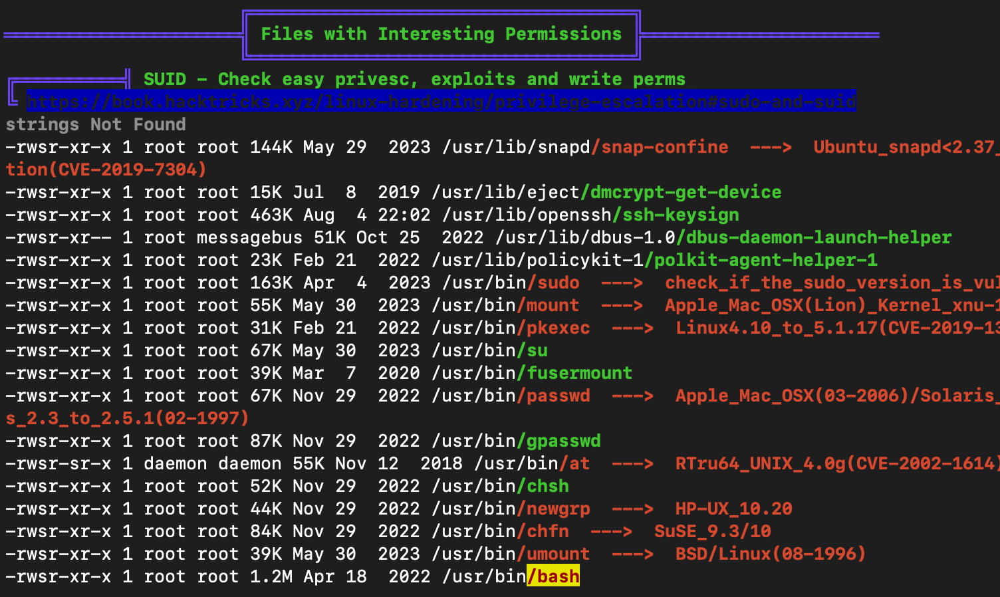

We also was able to find a payload in [GTFIO Bins](https://gtfobins.github.io/gtfobins/bash/#suid)

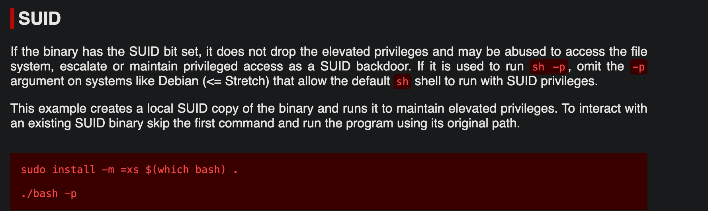

We then used the `-p` flag to the bash binary that was placed in `/usr/bin/bash` (In this image i used the `bash` binary that was in the `/bin` directory as both are same) and was able to get a `root` shell and grab the root flag :

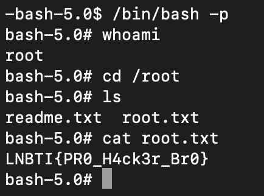

---

To Complete this box :
- Knowledge to use John the ripper to crack and convert files into hashes.
- An idea about Linux Privilege Escalation abusing SUID binaries.
- Ability to use Gobuster.

Notes :
- `pdf2john` is a utility that extracts the hash from a PDF file, making it usable with John for password cracking. It converts the PDF hash to a format that John can understand and work with.
- SUID (Set User ID) is a permission that allows a user to execute a file with the permissions of the file owner. Abusing SUID binaries can lead to privilege escalation by exploiting vulnerabilities in these executables. Attackers may leverage poorly configured or vulnerable SUID binaries to execute arbitrary code with elevated privileges, facilitating unauthorized access to sensitive resources on a system. It is crucial for system administrators to carefully review and secure SUID binaries to prevent potential exploitation and privilege escalation attacks