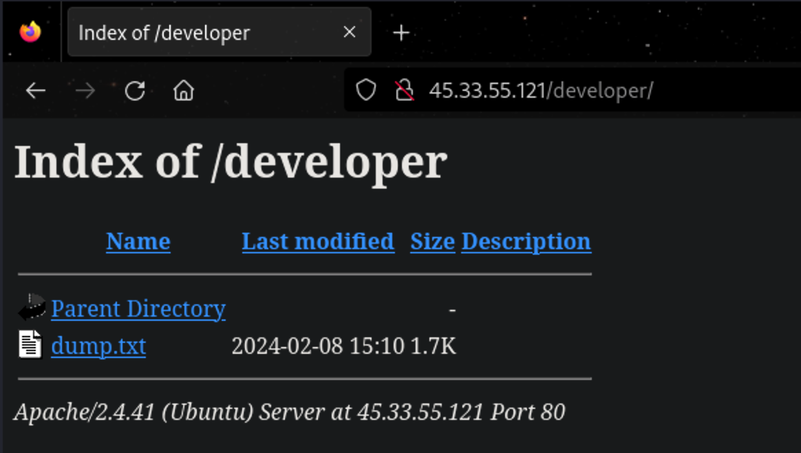
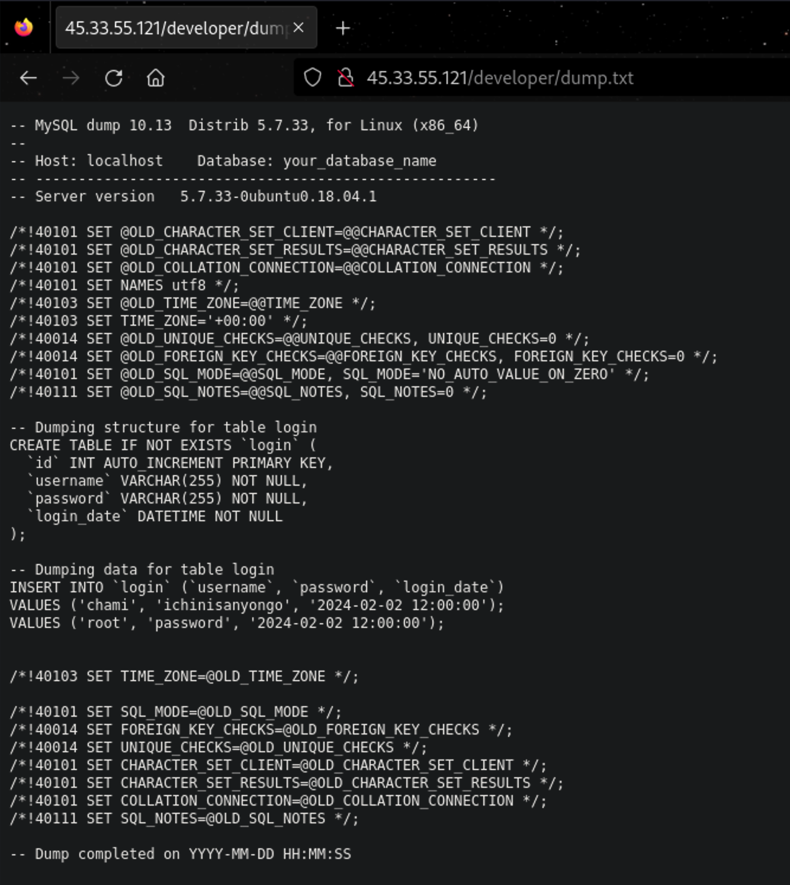
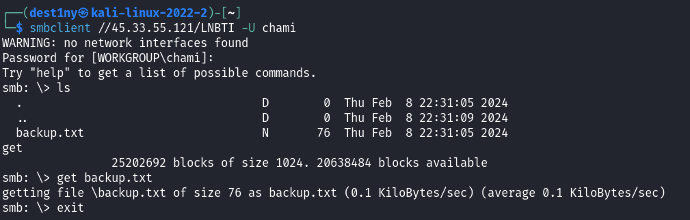
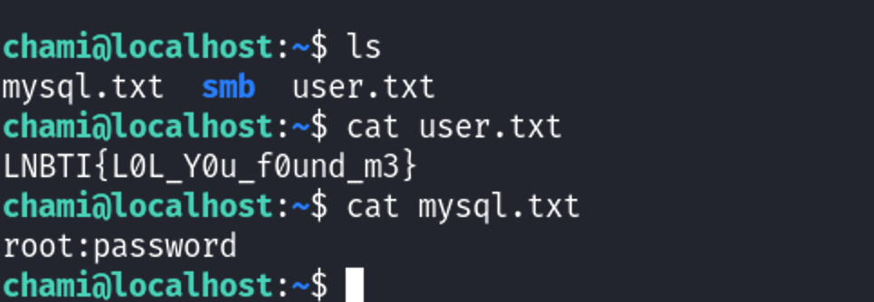
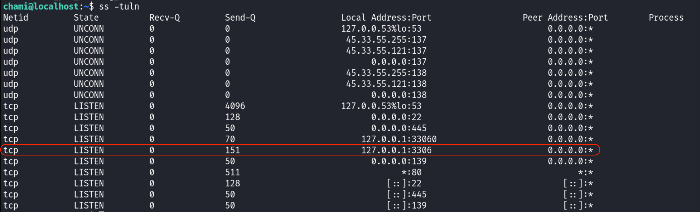
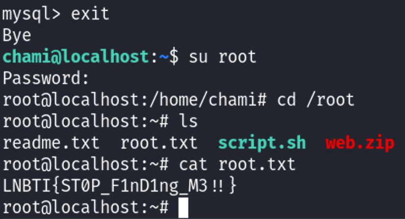

### Session : 


### Recon
We ran an `nmap` scan as usual to check the open ports in this machine before attacking :

```
┌──(dest1ny㉿kali-linux-2022-2)-[~]
└─$ nmap -sC -sV 45.33.55.121 
Starting Nmap 7.94 ( https://nmap.org ) at 2024-02-08 22:39 +0530
Nmap scan report for 45-33-55-121.ip.linodeusercontent.com (45.33.55.121)
Host is up (0.25s latency).
Not shown: 993 closed tcp ports (conn-refused)
PORT     STATE    SERVICE     VERSION
22/tcp   open     ssh         OpenSSH 8.2p1 Ubuntu 4ubuntu0.9 (Ubuntu Linux; protocol 2.0)
| ssh-hostkey: 
|   3072 e1:d9:51:95:65:5c:90:a8:63:88:c3:e4:0f:5a:1a:81 (RSA)
|   256 c2:18:1c:e7:3b:85:0f:0e:09:40:41:42:a0:c5:44:11 (ECDSA)
|_  256 8b:18:ce:2a:b6:fc:db:3c:16:c6:05:cf:cc:ff:1e:9c (ED25519)
80/tcp   open     http        Apache httpd 2.4.41 ((Ubuntu))
|_http-title: Blume
|_http-server-header: Apache/2.4.41 (Ubuntu)
139/tcp  open     netbios-ssn Samba smbd 4.6.2
445/tcp  open     netbios-ssn Samba smbd 4.6.2
Host script results:
| smb2-time: 
|   date: 2024-02-08T17:09:50
|_  start_date: N/A
|_nbstat: NetBIOS name: LOCALHOST, NetBIOS user: <unknown>, NetBIOS MAC: <unknown> (unknown)
| smb2-security-mode: 
|   3:1:1: 
|_    Message signing enabled but not required

Service detection performed. Please report any incorrect results at https://nmap.org/submit/ .
Nmap done: 1 IP address (1 host up) scanned in 50.23 seconds

```

We found that :
- Port 80 runs `Apache httpd 2.4.41` Webserver
- Port 139,445 runs `Samba smbd 4.6.2` 

To enumerate Port 80, we used a web browser and visited the ip address of the machine and was able to see a website :


Since we saw that port 80 was open, We ran a Gobuster scan to look for any hidden directories so we can visit it. We were able to see two new directories as `/developer`.

```
┌──(dest1ny㉿kali-linux-2022-2)-[~]
└─$ gobuster dir -u http://45.33.55.121 -w /usr/share/wordlists/dirbuster/directory-list-2.3-medium.txt
===============================================================
Gobuster v3.6
by OJ Reeves (@TheColonial) & Christian Mehlmauer (@firefart)
===============================================================
[+] Url:                     http://45.33.55.121
[+] Method:                  GET
[+] Threads:                 10
[+] Wordlist:                /usr/share/wordlists/dirbuster/directory-list-2.3-medium.txt
[+] Negative Status codes:   404
[+] User Agent:              gobuster/3.6
[+] Timeout:                 10s
===============================================================
Starting gobuster in directory enumeration mode
===============================================================
/assets               (Status: 301) [Size: 313] [--> http://45.33.55.121/assets/]
/css                  (Status: 301) [Size: 310] [--> http://45.33.55.121/css/]
/developer            (Status: 301) [Size: 316] [--> http://45.33.55.121/developer/]
/js                   (Status: 301) [Size: 309] [--> http://45.33.55.121/js/]

```

We visited the `/development` directory and was able to see a `dump.txt` file:



While reading it, we were able to see that it was a MySQL dump and contained some credentials. However, since we didn't have any MySQL ports open, we couldn't use it yet.



### Samba

We then used those credentials to access the SMB Port, We used `smbclient` to view the available shares and was able to use the credentials we found earlier and access .

```
┌──(dest1ny㉿kali-linux-2022-2)-[~]
└─$ smbclient -L //45.33.55.121 -U chami 
WARNING: no network interfaces found
Password for [WORKGROUP\chami]:

        Sharename       Type      Comment
        ---------       ----      -------
        print$          Disk      Printer Drivers
        LNBTI           Disk      
        IPC$            IPC       IPC Service (localhost server (Samba, Ubuntu))
```

We then connected to the smb share `LNBTI` as the user `chami` using the below command. We were then able to find a `backup.txt` file. We used the `get` command again and downloaded the file to our local machine and exited the service.



We then again used the `cat` command to see the contents inside the file, And we were able to get the password of the user `chami` . so we used ssh to login into chami  :

```
┌──(dest1ny㉿kali-linux-2022-2)-[~]
└─$ cat backup.txt 
SMB Backup Completed on 8.02.2024 : chami:blahblahblah : Ubuntu Linux 20LTS
```

We were then able to grab the user flag and a Mysql credentials just as from the dump we found eariler :



We had a question saying to find a file named `findmeifucan.txt` in our questions. So we used the `find` command with the `-name` tag to search for the file and was able to see that it inside a hidden directory and we used the `cat` command to view the contents of the file.

Note : In linux systems, Hidden files has a `.` in front of the file name. 

```
chami@localhost:~$ find / -name "findmeifucan.txt" 2>/dev/null
/home/chami/.backup/findmeifucan.txt
```

Here's a breakdown of the command `find / -name "findmeifucan.txt" 2>/dev/null`:

1. **`find`**: This is the command used for searching files and directories within a specified directory hierarchy.

2. **`/`**: This specifies the starting point of the search. In this case, `/` denotes the root directory, meaning the search will start from the root of the filesystem and traverse downward.

3. **`-name "findmeifucan.txt"`**: This is an option for `find` that specifies the name of the file to search for. In this case, it's searching for a file named "findmeifucan.txt". The `-name` option is used to match filenames using shell-style wildcards, so `"findmeifucan.txt"` is the exact filename being searched for.

4. **`2>/dev/null`**: This part of the command deals with error handling. 
   - `2>`: This redirects the standard error stream (file descriptor 2).
   - `/dev/null`: This is a special device file that discards all data written to it.

```
chami@localhost:~$ cat /home/chami/.backup/findmeifucan.txt
LNBTI{G00d_j0b_f1nd1ng_m3}
```

### Privilege Escalation
We checked the active ports using the command `ss -tuln` and were able to see that port 3306 (MySQL) is open locally (You can find this using Linpeas too).



We connected to the mysql service using the username `root` and password `password` and was able to grab the flag and the password of the root :

```mysql
chami@localhost:~$ mysql -u root -p                                
Enter password:                                                     
Welcome to the MySQL monitor.  
Commands end with ; or \g.           
Your MySQL connection id is 8                                 
Server version: 8.0.36-0ubuntu0.20.04.1 (Ubuntu)
Copyright (c) 2000, 2024, Oracle and/or its affiliates.
Oracle is a registered trademark of Oracle Corporation and/or its
affiliates. Other names may be trademarks of their respective
owners.

Type 'help;' or '\h' for help. Type '\c' to clear the current input statement.

mysql> show databases;
+--------------------+
| Database           |
+--------------------+
| employees          |
| information_schema |
| mysql              |
| performance_schema |
| sys                |
+--------------------+
5 rows in set (0.01 sec)

```

```mysql
mysql> use employees;
Reading table information for completion of table and column names
You can turn off this feature to get a quicker startup with -A

Database changed
mysql> show tables;
+---------------------+
| Tables_in_employees |
+---------------------+
| credentials         |
+---------------------+

```

```mysql
mysql> select * from credentials;
+------+--------------------------+
| user | password                 |
+------+--------------------------+
| root | LNBTI##LNBTI123#         |
| flag | LNBTI{InT3rn4l_S3rvic3s} |
+------+--------------------------+
2 rows in set (0.00 sec)
```

We were able to use the `su` command and switched into the `root` user and grab the root flag:



Optional : We can use ssh to login into the `root` user too by using the command :

```
ssh root@{MACHINE_IP}
```
